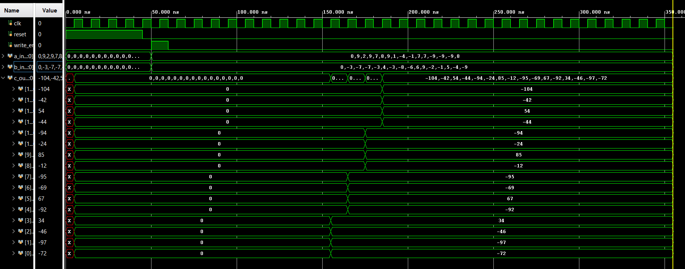

# 🚀 AI Matrix Multiplication Accelerator (SystemVerilog)

A high-performance hardware accelerator designed for 4x4 signed matrix multiplication, optimized for AI and Deep Learning workloads. This design leverages advanced digital logic to maximize throughput.

## 🏗️ Architectural Features

### 1. Radix-4 Booth Multiplier Engine
The core multiplication logic uses **Radix-4 Booth Encoding**. 
- **Efficiency:** Reduces the number of partial products by 50% compared to standard multipliers.
- **Optimization:** Lowers the total gate count and propagation delay, ideal for high-speed inference.

### 2. Specialized Memory Subsystem (`mem_mod_a` & `mem_mod_b`)
To prevent data bottlenecks, the design uses a dual-port memory architecture:
- **Module A (Row-wise):** Delivers a single row of the first matrix per clock cycle using a dynamic row pointer.
- **Module B (Static/Weight):** Holds the entire second matrix (weights) for constant reuse, minimizing repeated memory fetches and saving power.

### 3. Pipelined MAC (Multiply-Accumulate) Unit
The Processing Elements (PEs) are structured in a parallel architecture:
- **Streaming Logic:** Data flows from memory into a pipelined MAC unit.
- **Latency Management:** Implements a 9-cycle pipeline to stabilize and register outputs before final storage in the result array.

## 📊 Simulation & Verification
Verified using a SystemVerilog testbench in **Xilinx Vivado**.

### Waveform Analysis
The simulation confirms the 9-cycle latency and the functional accuracy of the Booth-encoded multiplication.

## 📁 Repository Structure
- `top_module.sv`: Top-level integration and control logic.
- `mem_mod_a.sv`: Row-based memory controller for Matrix A.
- `mem_mod_b.sv`: Full-matrix weight storage for Matrix B.
- `mac.sv`: Row-wise MAC controller handling column-parallel math.
- `pe.sv`: Individual Processing Element for dot-product calculation.
- `booth.sv`: Core Radix-4 logic for optimized multiplication.
- `tb_top.sv`: Complete verification testbench.

## 🔬 Tech Stack
- **HDL:** SystemVerilog / Verilog
- **Tools:** Xilinx Vivado (Synthesis & Simulation)
- **Target:** FPGA/ASIC Synthesizable RTL
